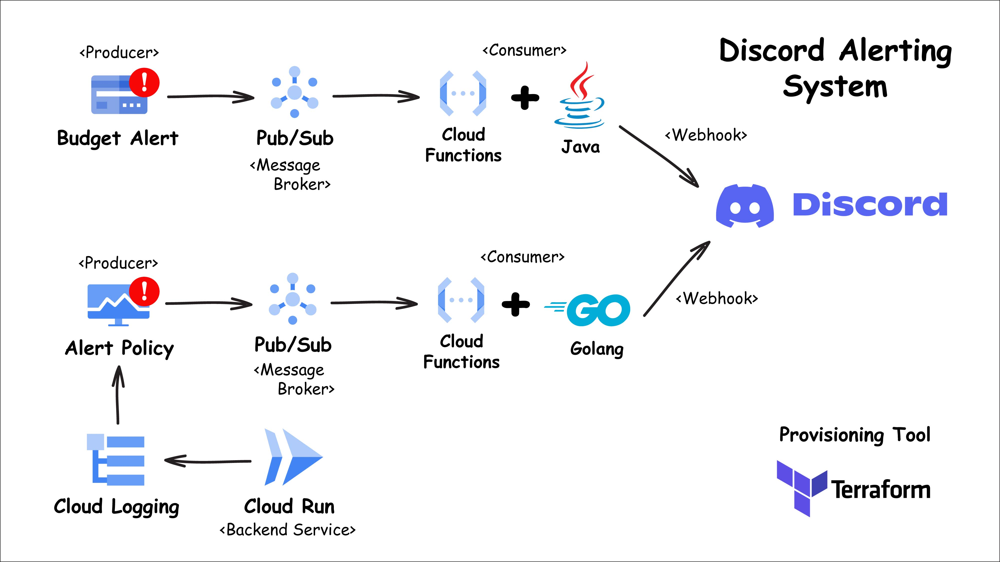

# Discord Alerting System
Alerting system connected to Discord (via webhook) by implementing Event-Driven Architecture (EDA).

## Architecture
<p align="center">
    </img>
</p>

## How to install
```
  gsutil mb -p <PROJECT> -l <REGION> gs://alerting-service-bucket

  terraform init

  terraform apply -auto-approve \
    -var="discord_id=<DISCORD_ID>" \
    -var="discord_token=<DISCORD_TOKEN>"
```

## Implementation Example
<p align="center">
    </img>
</p>